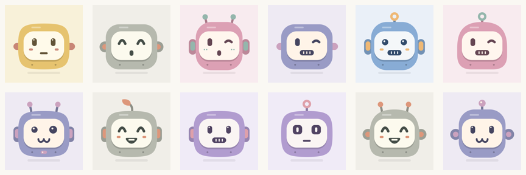

# Roboticon

Cute, deterministic robot avatars for Go. Same seed, same little friend.



**[Try the live playground →](https://southclaws.github.io/roboticon/)**

**230,400 possible trait combinations:** 5 heads × 8 eyes × 6 mouths × 5 antenna
choices × 4 ear choices × 4 accessory choices × 12 curated palettes. Optional
features include “none”; accessories appear on about one third of robots.

```go
import "github.com/Southclaws/roboticon"

avatar := roboticon.Generate("some-stable-id")
err := avatar.RenderPNG(w, 256)
err = avatar.RenderSVG(w, 256)

// The generated background is included by default.
err = avatar.RenderPNG(w, 256, roboticon.TransparentBackground)
err = avatar.RenderSVG(w, 256, roboticon.TransparentBackground)
```

Requires **Go 1.27+**. Pure Go. Render sizes: 1–2048px. Square, unmasked outputs
fit comfortably inside a circular avatar crop. Traits are independent of size;
SHA-256 streams keep generation deterministic. Distinct seeds can select the
same character.

The live playground runs the **real Go library through WebAssembly**, including
PNG and SVG downloads. Seeds stay in your browser.

```sh
go run ./cmd/gallery        # Offline gallery: gallery/index.html
sh scripts/build-web.sh    # Live playground: serve web/dist over HTTP
go test -race ./...
```
